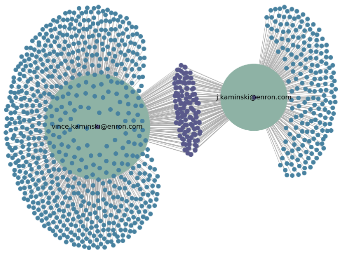
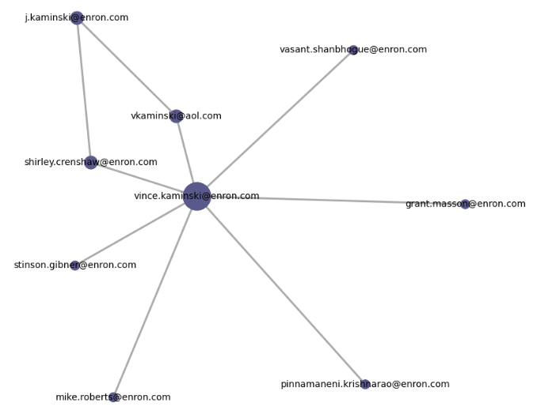
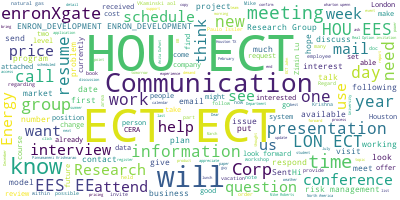
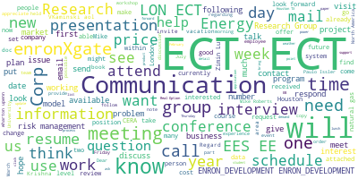

## The Rise and Fall of Enron

{ width=80% }

## Project Goal

- deeper technological understanding of dedicated investigations software
- network analysis of persons of interest to gain a focused direction for NLP analysis

## Project Structure

{ width=80% }

## Network of Vincent Kaminski's Outgoing Emails

{ width=60% }

## Top 10 Correspondents

 Top 10 Correspondents
{ width=100% }

 

 Top 10 Degree Centrality Scores
{ width=100% }

## Most Frequent Words in Close Network 

 Top 10 Correspondents
{ width=100% }

 

 Other Persons of Interest
{ width=100% }

---

Any Questions?

Thank you!